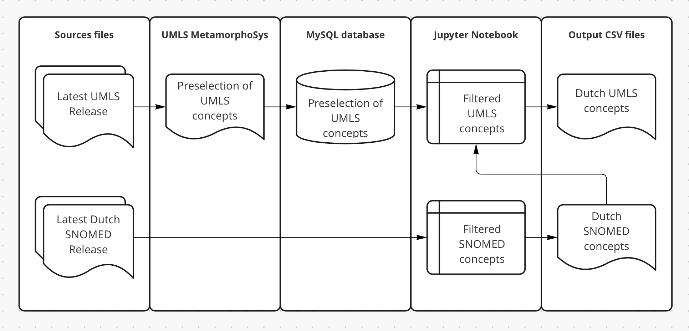

# Dutch Medical Concepts
This repository contains instructions and code to create concept tables of Dutch medical names, such as primary names, synonyms, abbreviations, and common misspellings. By basing a concept table on UMLS, which includes MeSH, MedDRA, ICD-10 and ICPC, and adding SNOMED CT and our own translations, a comprehensive set of words commonly used in Dutch medical language is generated. Workflows for creating SNOMED and HPO based concept tables are also in this repository.

The resulting concept tables can be used in named entity recognition and linking methods, such as MedCAT, to identify entities in Dutch medical text. 

| Ontology | Number of concepts | Number of names | Primary source |
| - | - | - | - |
| Dutch UMLS | 254835 | 574475 | UMLS 2022AB |
| Dutch UMLS with English drug names | 367913 | 754326 | UMLS 2022AB |
| Dutch SNOMED | 230277 | 521118 | SNOMED CT Netherlands Edition September 2022 v1.0 |
| Dutch HPO | 13360 | 29164 | [Dutch HPO translations](https://crowdin.com/project/hpo-translation/nl) |

Data and licenses should be acquired from [UMLS Terminology Services](https://uts.nlm.nih.gov/uts/) and [SNOMED MLDS](https://mlds.ihtsdotools.org/). 

## Table of Contents
- [Download Dutch MedCAT models](#download-dutch-medcat-models)
- [Folder structure](#folder-structure)
- [Generate UMLS concept table](#generate-umls-concept-table)
	- [1. Obtain license and download complete UMLS](#1-obtain-license-and-download-complete-umls)
	- [2. Decompress and install MetamorphoSys](#2-decompress-and-install-metamorphosys)
	- [3. Select UMLS concepts for Dutch medical language using MetamorphoSys](#3-select-umls-concepts-for-dutch-medical-language-using-metamorphosys)
	- [4. Load all terms in a SQL database](#4-load-all-terms-in-a-sql-database)
	- [5. Create concept table](#5-create-concept-table)
- [Generate SNOMED concept table](#generate-snomed-concept-table)
- [Generate HPO concept table](#generate-hpo-concept-table)
- [Generate MedCAT models](#generate-medcat-models)

## Download Dutch MedCAT models
On https://github.com/CogStack/MedCAT it's possible to authenticate via UMLS Terminology Services to verify the user's UMLS license and download a MedCAT model based on the Dutch UMLS concepts generated in this repository.

## Folder structure
The methods of this repository require a number of input files, which should be downloaded by the user, and intermediate and output files are generated. This repository contains a folder structure that can be used for storing these files. The contents of these folders, except for `05_CustomChanges`, are added not tracked by Git, which makes it easier to replace input files or recreate output files.
```
dutch-medical-concepts
└───01_Download
└───02_ExtractSubset
└───03_SqlDB
└───04_ConceptDB
└───05_CustomChanges
```

## Generate UMLS concept table


Output CSV format will look like this:

| cui      | name                     | ontologies           | name_status | type_ids |
|----------|--------------------------|----------------------|-------------|----------|
| C0000001 | kanker                   | ONTOLOGY1\|ONTOLOGY2 | P           | T001     |
| C0000001 | neoplasma maligne        | ONTOLOGY1            | A           | T001     |
| C0000002 | longkanker               | ONTOLOGY1            | P           | T001     |
| C0000003 | kleincellige longkanker  | ONTOLOGY1            | P           | T001     |
| C0000004 | chirurgie                | ONTOLOGY1            | P           | T002     |
| C0000004 | chirurgische verrichting | ONTOLOGY1            | A           | T002     |
| C0000005 | chirurgie                | ONTOLOGY1            | P           | T003     |
| C0000005 | specialisme chirurgie    | ONTOLOGY1            | A           | T003     |

See https://github.com/CogStack/MedCAT/tree/master/examples for a detailed explanation of the columns.

I'm not sure whether the UMLS license allows for publishing snippets of UMLS data for demonstration purposes, so this repository uses mock data in the examples.

### 1. Obtain license and download complete UMLS 
To download UMLS, visit the [NIH National Library of Medicine website](https://www.nlm.nih.gov/research/umls/licensedcontent/umlsknowledgesources.html). You'll have to apply for a license before you can download the files on https://www.nlm.nih.gov/research/umls/licensedcontent/umlsknowledgesources.html. In the following description I downloaded `Full Release (umls-2022AB-full.zip)`. The advantage over `UMLS Metathesaurus Full Subset` is that the Full Release includes MetamorphoSys which makes it possible to create a subset of UMLS prior loading the data in a SQL database. This significantly decreases the required disk space and processing time.

### 2. Decompress and install MetamorphoSys
After decompressing the `*-full.zip` file, go into the folder (e.g. `01_Download/2022AB-full` in this example) and decompress `mmsys.zip`. Afterwards, move the files in the new `mmsys` folder one level up, so they are in `2022AB-full`. Next, run MetamorphoSys (`./run_mac.sh` on macOS)

### 3. Select UMLS concepts for Dutch medical language using MetamorphoSys
MetamorphoSys is used to install a subset of UMLS. During the installation process it is possible to select multiple sources, and thereby to craft a specific subset for your use case. In our case, our primary goal is to select the Dutch terms and we add some English sources for concept categories for common used English names in Dutch (such as drug names).

- Select `Install UMLS`.
- Select destination directory, for example `./02_ExtractSubset/2022AB/`
- Keep `Metathesaurus` checked, and uncheck `Semantic Network` and `SPECIALIST Lexicon & Lexical Tools`. Select `OK`.
- Select `New Configuration...`, click `Accept` and click `Ok`. The `Default Subset` does not matter because we are making our own subset in the next step.
- In the `Output Options` tab, select `MySQL 5.6` under `Select database`.
- In the `Source List` tab, Select `Select sources to INCLUDE in subset`. Sort the sources on the language column and at least select the 7 Dutch sources. To select multiple sources, hold the CMD key on macOS. In the popup window that will ask if you also want to include related sources, click `Cancel`. The Dutch sources I included were:

| Source name | Source ID |
|---|---|
| ICD10, Dutch Translation, 200403 | ICD10DUT_200403 |
| ICPC2-ICD10 Thesaurus, Dutch Translation | ICPC2ICD10DUT_200412 |
| ICPC2E Dutch | ICPC2EDUT_200203 |
| ICPC, Dutch Translation, 1993 | ICPCDUT_1993 |
| LOINC Linguistic Variant - Dutch, Netherlands | LNC-NL-NL_273 |
| MedDRA Dutch | MDRDUT25_0 |
| MeSH Dutch | MSHDUT2005 |

More information on the sources can be found at: https://www.nlm.nih.gov/research/umls/sourcereleasedocs/index.html

- For drug names some commonly used synonyms in Dutch langague are missing in these vocabularies. Therefore I also selected the following English sources:
  - `ATC_2022_22_09_06`
  - `DRUGBANK5.0_2022_08_01`
  - `RXNORM_20AA_220906F`.
- Also, it's useful to include other categories useful for remapping source ontologies (such as Dutch SNOMED -> English SNOMED -> UMLS). The selection of Dutch and English drug names is done in a Jupyter Notebook in a later step, so it's okay to include some more non-Dutch sources in this step. At UMCU we included the following sources:
  - `SNOMEDCT_US_2022_09_01` (required for adding Dutch SNOMED terms in a later step)
  - `HPO2020_10_12`
  - `MTH`
- In the `Suppressibility` tab, make sure the obsolete terms are suppressed (`LO` for LOINC, `OL` for MedDRA; see https://www.nlm.nih.gov/research/umls/knowledge_sources/metathesaurus/release/abbreviations.html). In my configuration, I unsuppressed the "Abbreviation in any source vocabulary" (`AB`) concepts from MedDRA.
- On macOS, in the top bar, select `Advanced Suppressibility Options` and check all checkboxes. This makes sure the suppressed terms are excluded from the subset.
- On macOS, in the top bar, select `Done` and `Begin Subset`. This process takes 5-10 minutes.
- Save the SubSet log for future reference.

### 4. Load all terms in a SQL database
To select only the columns required for the target list of terms, first put all the resulting subset in a SQL DB. 

```bash
# Create local .env file
cp .env-example .env

# Set local file paths & MySQL root password in .env

# Set MySQL loading config settings 
vim ./02_ExtractSubset/2022AB/META/populate_mysql_db.sh

MYSQL_HOME=/usr
user=root
password=${MYSQL_ROOT_PASSWORD}
db_name=${MYSQL_DATABASE}

# Start MySQL container in Docker
docker-compose up -d

# Enter docker container
docker exec -it umls bash

# Execute mysql loading script
cd /src_files/2022AB/META/
bash populate_mysql_db.sh
```

The official documentation for loading UMLS in a MySQL DB can be found at [here](https://www.nlm.nih.gov/research/umls/implementation_resources/scripts/README_RRF_MySQL_Output_Stream.html).

### 5. Create concept table

#### Preferred method: Fine-tuned and filtered
Some source vocabularies contain concept types that are not useful for entity 
linking. Also, Dutch vocabularies in UMLS do not contain many drug names. Use 
[dutch-umls_to_concept-table.ipynb](dutch-umls_to_concept-table.ipynb) to:
  - Download concepts, names and types from the MySQL database
  - Remove irrelevant concepts based on term type in source vocabulary
  - Remove irrelevant concepts based on UMLS type
  - Remove problematic names for Dutch language
  - Add many concepts and synonyms from Dutch SNOMED
  - Add custom names
  - Save the concept table in a format compatible with MedCAT

Note: This requires a Dutch SNOMED concept table, which can be created in
[dutch-snomed_to_concept-table.ipynb](dutch-snomed_to_concept-table.ipynb).

To setup the Python environment, install the required Python Packages with PIP:
```bash
pip install -r requirements.txt
```

#### Alternate method: rough & fast
Target file should follow the specifications defined in the [MedCAT repository](https://github.com/CogStack/MedCAT/blob/master/examples/README.md).

In short:

| Column | Description | Example values |
|-|-|-|
|cui| concept id | C0000001 |
|name| term name | Longkanker|
|name_status| Term type in source | PN (Primary name), SY (Synonym), for others see https://www.nlm.nih.gov/research/umls/knowledge_sources/metathesaurus/release/abbreviations.html#TTY |
|type_ids| Semantic type identifier | T047 (Based on UMLS) |
|ontologies| Source Ontology | SNOMEDCT_US, MSHDUT, MDRDUT, ICPC2EDUT, ICPCDUT, or something custom |

Select the relevant columns using your preferred way of interacting with SQL databases and save the results to a CSV-file. Also include the header. A quick way to do this, is:
```sql
SELECT distinct MRCONSO.cui, str as name, sab as ontologies, tty as name_status, tui as type_ids
FROM MRCONSO
LEFT JOIN MRSTY ON MRSTY.cui = MRCONSO.cui
ORDER BY MRCONSO.cui ASC;
```

The output should look like this:
```bash
% head -5 umls-dutch.csv 
cui,name,ontologies,name_status,type_ids
C0000001,A-zenuwvezels,ONTOLOGY1,PN,T001
C0000002,Abattoir,ONTOLOGY1,PN,T002
C0000002,Abattoirs,ONTOLOGY1,SY,T002
C0000003,Abbreviated Injury Scale,ONTOLOGY1,PN,T003
```

## Generate SNOMED concept table
Method in: [dutch-snomed_to_concept-table.ipynb](dutch-snomed_to_concept-table.ipynb)

License and source files can be acquired from [SNOMED MLDS](https://mlds.ihtsdotools.org/).

## Generate HPO concept table
Method in: [dutch-snomed_to_concept-table.ipynb](dutch-snomed_to_concept-table.ipynb)

Most HPO names were translated to Dutch by Radboudumc's Clinical Genetics team via [CrowdIn](https://crowdin.com/project/hpo-translation/nl). This is the primary source in creating a concept table of Dutch HPO concepts. In an effort to make a more complete set of synonyms, names from UMLS and SNOMED, as well as some of our own translations, are added.

## Generate MedCAT models
To generate MedCAT models from the concept table, see the instructions in the [MedCAT](https://github.com/CogStack/MedCAT) repository. For Dutch language, use these parameters in the configuration:
```python
# Set Dutch spaCy model. The small or medium models should also be fine.
cat.general.spacy_model = 'nl_core_news_lg'

# This handles diacritics, which are common in Dutch language but not in English language.
cat.general.diacritics = True

# This distinguishes "ALS" (the disease) from "als" (voegwoord en voorzetsel).
cat.ner.check_upper_case_names = True
```

MedCAT contains functionality for unsupervised training to solve ambiguity of medical concepts. A relatively easy way to do this is by providing Dutch medical wikipedia articles. Although this is not representable for clinical language used in EHRs, the resulting model performs surprisingly well. See [dutch-medical-wikipedia](https://github.com/umcu/dutch-medical-wikipedia) for instructions on how to generate this dataset.
